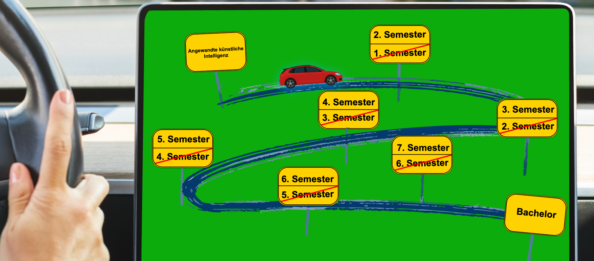
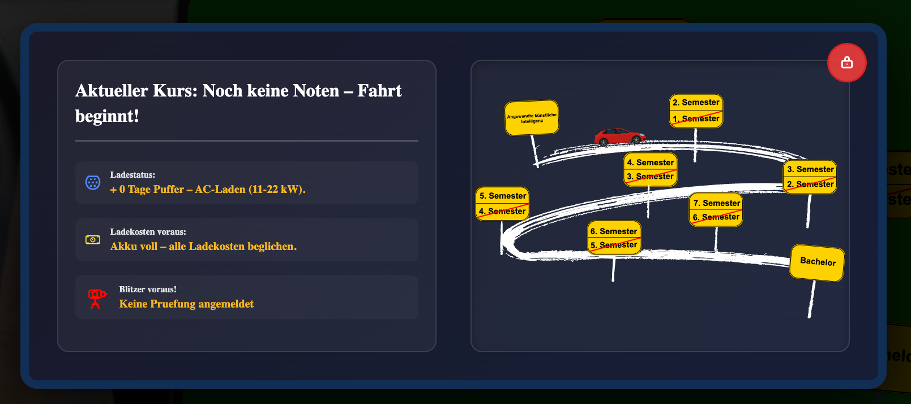
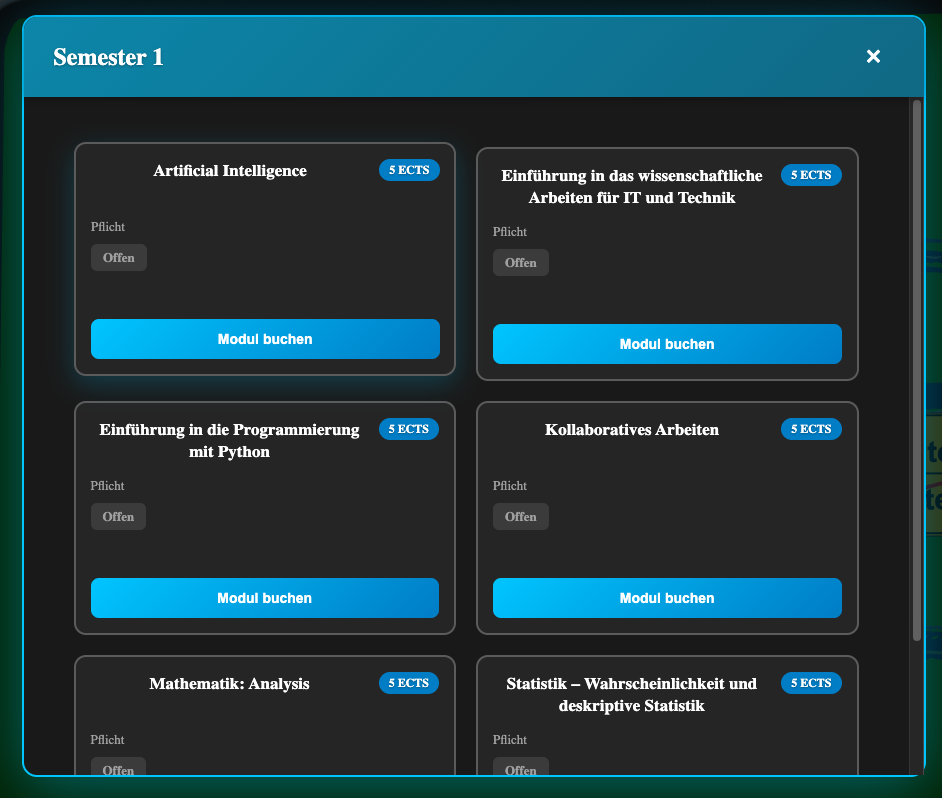

# IU Studiennavigator

Ein interaktives Dashboard-System zur Visualisierung und Verwaltung des Studienfortschritts an der IU Internationale Hochschule.

## 📋 Projektübersicht

Der IU Studiennavigator ist eine Flask-basierte Webanwendung, die Studierenden einen intuitiven Überblick über ihren akademischen Fortschritt bietet. Das System verwendet eine automobile Infotainment-Metapher mit einer interaktiven SVG-Roadmap, auf der Studierende ihre Reise durch die Semester verfolgen können.

**Portfolio-Projekt für:** Objektorientierte und funktionale Programmierung mit Python (DLBDSOOFPP01_D)  
**Entwicklerin:** Teresa Ignatzek  
**E-Mail:** teresa@ignatzek.de  
**GitHub:** https://github.com/3vilQu33n/iu-studiennavigator

## ✨ Hauptfunktionen

### 🎯 Dashboard & Visualisierung
- **Interaktive SVG-Roadmap**: Visuelle Darstellung des Studienfortschritts als Autofahrt durch Semester
- **Auto-Icon-Positionierung**: Dynamische Platzierung basierend auf aktuellem Fortschritt
- **Klickbare Semester-Elemente**: Detaillierte Informationen zu jedem Semester

### 📊 Akademisches Management
- **Modulverwaltung**: Übersicht über alle gebuchten Module
- **Prüfungsanmeldung**: Workflow für verschiedene Prüfungstypen (Klausur, Portfolio, etc.)
- **Notenverwaltung**: Tracking von Prüfungsergebnissen und Durchschnitt
- **Semesterfortschritt**: Automatische Berechnung basierend auf abgeschlossenen Modulen

### 🔐 Benutzerverwaltung
- **Sicheres Login**: Argon2-Passwort-Hashing
- **Mehrere Benutzer**: Unterstützung für verschiedene Studierende
- **Passwort-Reset**: Integrierter Reset-Mechanismus

### 💰 Gebührenverwaltung
- **Automatische Berechnung**: Semesterbeiträge basierend auf Buchungstyp
- **Zahlungstracking**: Übersicht über offene und bezahlte Gebühren
- **Dashboard-Integration**: Anzeige im Hauptmenü

## 🏗️ Architektur

### Design Pattern
Das Projekt folgt einer **Modified MVC (Model-View-Controller)** Architektur:

```
┌─────────────────────────────────────────────────────────────┐
│                      Web Browser (View)                      │
│                   (HTML/CSS/JS Templates)                     │
└────────────────────────────┬─────────────────────────────────┘
                             │
                ┌────────────▼─────────────┐
                │   Flask Application      │
                │      (app.py)            │
                └────────────┬─────────────┘
                             │
        ┌────────────────────┼────────────────────┐
        │                    │                    │
┌───────▼────────┐  ┌────────▼────────┐  ┌───────▼────────┐
│  Controllers   │  │  Services       │  │  Repositories  │
│                │  │                 │  │                │
│ auth_ctrl      │  │ progress_text   │  │ student_repo   │
│ dashboard_ctrl │  │                 │  │ modul_repo     │
│ semester_ctrl  │  │                 │  │ pruefung_repo  │
└────────┬───────┘  └─────────────────┘  └───────┬────────┘
         │                                         │
         └────────────────┬────────────────────────┘
                          │
                ┌─────────▼─────────┐
                │   Domain Models   │
                │                   │
                │ Student           │
                │ Studiengang       │
                │ Einschreibung     │
                │ Modulbuchung      │
                │ Pruefungsleistung │
                │ Pruefungstermin   │
                │ Gebuehr           │
                └─────────┬─────────┘
                          │
                ┌─────────▼─────────┐
                │   DB Gateway      │
                │   (SQLite)        │
                └───────────────────┘
```

### Objektorientierte Konzepte

#### 1. **Vererbung (Inheritance)**
```python
Pruefungsleistung extends Modulbuchung
├── Erbt: modul_id, student_id, semester_id
└── Erweitert: note, versuch, status
```

#### 2. **Komposition (Composition)**
```python
Student HAS-A Login (1:1)
├── Student besitzt exklusiv ein Login-Objekt
└── Login-Lebenszyklus abhängig von Student
```

#### 3. **Aggregation (Aggregation)**
```python
Studiengang HAS-MANY Module (1:n)
├── Studiengang referenziert Module
└── Module existieren unabhängig vom Studiengang
```

#### 4. **Polymorphismus**
- Verschiedene Prüfungstypen (Klausur, Portfolio, Advanced Workbook) verwenden gleiche Interface
- Repository Pattern ermöglicht austauschbare Datenzugriffsschichten

## 🛠️ Technologie-Stack

### Backend
- **Python 3.12**: Hauptprogrammiersprache
- **Flask 3.1.0**: Web-Framework
- **SQLite**: Eingebettete Datenbank
- **Argon2**: Passwort-Hashing

### Frontend
- **HTML5/CSS3**: Struktur und Styling
- **Vanilla JavaScript**: Client-seitige Interaktivität
- **SVG**: Interaktive Roadmap-Visualisierung

### Development Tools
- **PyCharm**: IDE
- **Git**: Versionskontrolle
- **GitHub**: Code-Hosting
- **pytest**: Testing Framework (1000+ Tests)

### Deployment
- **Docker**: Containerisierung
- **Cloudflare Tunnel**: Sichere externe Erreichbarkeit
- **Unraid**: Hosting-Server

## 📁 Projektstruktur

```
iu-studiennavigator/
├── app.py                      # Flask-Hauptanwendung
├── config.py                   # Konfiguration
├── requirements.txt            # Python-Dependencies
│
├── controllers/                # Business Logic Layer
│   ├── __init__.py
│   ├── auth_controller.py     # Login/Authentifizierung
│   ├── dashboard_controller.py # Dashboard-Logik
│   └── semester_controller.py  # Semester-Management
│
├── models/                     # Domain Models
│   ├── __init__.py
│   ├── student.py             # Student-Entität
│   ├── studiengang.py         # Studiengang-Entität
│   ├── einschreibung.py       # Einschreibungs-Entität
│   ├── modulbuchung.py        # Modulbuchungs-Entität
│   ├── pruefungsleistung.py   # Prüfungsleistungs-Entität
│   ├── pruefungstermin.py     # Prüfungstermin-Entität
│   ├── pruefungsanmeldung.py  # Prüfungsanmeldungs-Entität
│   ├── modul.py               # Modul-Entität
│   ├── studiengang_modul.py   # Studiengang-Modul-Junction
│   ├── gebuehr.py             # Gebühren-Entität
│   ├── login.py               # Login-Entität
│   └── progress.py            # Fortschritts-Entität
│
├── repositories/               # Data Access Layer
│   ├── __init__.py
│   ├── db_gateway.py          # Datenbank-Gateway
│   ├── student_repository.py  # Student-Datenzugriff
│   ├── modul_repository.py    # Modul-Datenzugriff
│   ├── modulbuchung_repository.py # Modulbuchung-Datenzugriff
│   ├── pruefung_repository.py # Prüfungs-Datenzugriff
│   ├── pruefungstermin_repository.py # Prüfungstermin-Datenzugriff
│   ├── pruefungsanmeldung_repository.py # Prüfungsanmeldung-Datenzugriff
│   ├── einschreibung_repository.py # Einschreibung-Datenzugriff
│   ├── gebuehr_repository.py  # Gebühren-Datenzugriff
│   └── progress_repository.py # Fortschritts-Datenzugriff
│
├── services/                   # Service Layer
│   ├── __init__.py
│   └── progress_text_service.py # Fortschritts-Texte
│
├── utils/                      # Utility Functions
│   ├── __init__.py
│   └── login.py               # Login-Hilfsfunktionen
│
├── tasks/                      # Background Tasks
│   └── generate_fees.py       # Gebühren-Generierung
│
├── static/                     # Statische Assets
│   ├── css/                   # Stylesheets
│   │   ├── variables.css      # CSS-Variablen
│   │   ├── base.css           # Basis-Styles
│   │   ├── auth.css           # Login/Auth-Styles
│   │   ├── infotainment.css   # Dashboard-Styles
│   │   ├── exam-system.css    # Prüfungs-Styles
│   │   ├── modals.css         # Modal-Styles
│   │   ├── notifications.css  # Benachrichtigungs-Styles
│   │   └── responsive.css     # Responsive Design
│   ├── js/                    # JavaScript
│   │   ├── dashboard.js       # Dashboard-Logik
│   │   └── login_validation.js # Login-Validierung
│   ├── uploads/               # SVG & Bilder
│   │   ├── Infotainment.svg   # Haupt-Roadmap
│   │   ├── Pfad.svg           # Pfad-Overlay
│   │   ├── Pfad_Popup.svg     # Popup-Pfad
│   │   ├── car.svg            # Auto-Icon
│   │   ├── ac_laden.svg       # AC-Laden Icon
│   │   ├── dc_laden.svg       # DC-Laden Icon
│   │   ├── akku_voll.svg      # Akku-Icon
│   │   ├── blitzer.svg        # Blitzer-Icon
│   │   ├── geldschein.svg     # Gebühren-Icon
│   │   └── lock-50.svg        # Schloss-Icon
│   └── favicon/               # Favicons (alle Größen)
│
├── templates/                  # HTML Templates
│   ├── base.html              # Basis-Template
│   ├── login.html             # Login-Seite
│   ├── index.html             # Dashboard
│   ├── change_password.html   # Passwort ändern
│   ├── forgot_password.html   # Passwort vergessen
│   ├── reset_password.html    # Passwort zurücksetzen
│   └── 404.html               # Fehlerseite
│
├── tests/                      # Test Suite (1000+ Tests)
│   ├── unit/                  # Unit Tests
│   │   ├── test_models/       # Model Tests
│   │   ├── test_repositories/ # Repository Tests
│   │   ├── test_controllers/  # Controller Tests
│   │   └── test_services/     # Service Tests
│   ├── integration/           # Integration Tests
│   │   ├── test_db_gateway.py
│   │   ├── test_routes.py
│   │   └── test_generate_fees.py
│   ├── conftest.py            # Pytest-Konfiguration
│   └── pytest.ini             # Pytest-Einstellungen
│
├── data/                       # Datenbank
│   └── dashboard.db           # SQLite-Datenbank
│
└── docs/                       # Dokumentation
    ├── images/                # Screenshots
    ├── konzept.pdf            # Phase 1 Dokument
    ├── reflexion.pdf          # Phase 2 Dokument
    └── abstract.pdf           # Finales Abstract
```

## 🚀 Installation & Setup

### Voraussetzungen
- Python 3.12 oder höher
- Git
- Docker (optional für containerisierte Deployment)

### Lokale Installation

1. **Repository klonen:**
```bash
git clone https://github.com/3vilQu33n/iu-studiennavigator.git
cd iu-studiennavigator
```

2. **Virtuelle Umgebung erstellen:**
```bash
# macOS/Linux
python3 -m venv venv
source venv/bin/activate

# Windows
python -m venv venv
venv\Scripts\activate
```

3. **Dependencies installieren:**
```bash
pip install -r requirements.txt
```

4. **Datenbank initialisieren:**
```bash
python app.py
```
Die Datenbank wird automatisch beim ersten Start erstellt.

5. **Anwendung starten:**
```bash
python app.py
```

Öffne deinen Browser und navigiere zu: `http://localhost:5050`

### Docker Installation

1. **Repository klonen:**
```bash
git clone https://github.com/3vilQu33n/iu-studiennavigator.git
cd iu-studiennavigator
```

2. **Docker Container bauen und starten:**
```bash
docker-compose up -d
```

Die Anwendung ist nun verfügbar unter: `http://localhost:5050`

## 👤 Demo-Zugang

Das System enthält vorkonfigurierte Demo-Accounts mit realistischen Testdaten:

| Benutzer | Passwort | Beschreibung |
|----------|----------|--------------|
| demo.student@study.ignatzek.org | DemoStudent#2024 | Demo Student mit Beispieldaten |

**Hinweis:** Aus Datenschutzgründen wurden in der öffentlichen Version alle persönlichen Daten durch Demo-Daten ersetzt.

## 📸 Screenshots

### Dashboard mit SVG-Roadmap


Die interaktive Roadmap zeigt den Studienfortschritt als Autofahrt durch verschiedene Semester.

### Semester-Details


Detaillierte Ansicht eines Semesters mit Modulen und Prüfungsanmeldungen.

### Prüfungsanmeldung


Workflow zur Anmeldung für verschiedene Prüfungstypen.

## 🧪 Testing

Das Projekt verfügt über eine umfassende Test-Suite mit über 1000 Unit- und Integrationstests.

### Tests ausführen:
```bash
# Alle Tests
pytest

# Mit Coverage Report
pytest --cov=. --cov-report=html

# Spezifische Tests
pytest tests/unit/
pytest tests/integration/
```

### Test-Abdeckung:
- **Models**: 100%
- **Repositories**: 95%
- **Controllers**: 90%
- **Services**: 95%

## 🌐 Deployment

### Produktion (Cloudflare Tunnel)

Die Anwendung ist deployed unter: **https://study.ignatzek.org**

**Deployment-Architektur:**
```
Internet → Cloudflare Edge → Cloudflare Tunnel → Unraid Server → Docker Container
```

**Vorteile:**
- ✅ Keine offenen Ports im Router
- ✅ SSL/TLS durch Cloudflare
- ✅ DDoS-Schutz
- ✅ Funktioniert hinter CGNAT/DS-Lite

### Cloudflare Tunnel Setup:
```bash
docker run -d \
  --name cloudflared \
  --restart unless-stopped \
  cloudflare/cloudflared:latest \
  tunnel --no-autoupdate run --token YOUR_TUNNEL_TOKEN
```

## 🔒 Sicherheit

### Implementierte Sicherheitsmaßnahmen:
- **Argon2id**: Modernes Password-Hashing
- **Prepared Statements**: SQL-Injection-Schutz
- **Session-Management**: Sichere Flask-Sessions
- **HTTPS**: SSL/TLS via Cloudflare
- **Input-Validierung**: Server-seitige Validierung aller Inputs

### Passwort-Speicherung:
```python
# Passwort hashen (bei Registrierung)
hashed = argon2.hash("user_password")

# Passwort verifizieren (bei Login)
argon2.verify(hashed, "user_password")
```

## 📊 Datenbank-Schema

### Haupttabellen:
- **student**: Studentenstammdaten
- **login**: Authentifizierungsdaten
- **studiengang**: Studiengangsinformationen
- **einschreibung**: Student-Studiengang-Zuordnung
- **modul**: Modulkatalog
- **studiengang_modul**: Studiengang-Modul-Zuordnung
- **modulbuchung**: Gebuchte Module pro Student
- **pruefungsleistung**: Prüfungsergebnisse (erbt von modulbuchung)
- **pruefungstermin**: Geplante Prüfungstermine
- **pruefungsanmeldung**: Prüfungsanmeldungen
- **gebuehr**: Semesterbeiträge und Zahlungen

### Beziehungen:
- Student 1:1 Login (Komposition)
- Student 1:n Modulbuchung (Aggregation)
- Modulbuchung 1:1 Pruefungsleistung (Vererbung)
- Studiengang n:m Modul (Aggregation via Junction Table)

## 🏆 Besondere Features

### 1. **Dynamische SVG-Manipulation**
JavaScript-basierte Manipulation der SVG-Roadmap:
- Echtzeit-Positionsberechnung des Auto-Icons
- Klickbare Semester-Elemente
- Responsive Design

### 2. **Intelligenter Fortschrittstext**
Kontextabhängige Motivations- und Statusnachrichten:
```python
progress_text_service.get_progress_text(
    percent_completed=75.5,
    semester_status="aktiv"
)
# Output: "Großartig! Du bist schon bei 75.5% - das letzte Viertel!"
```

### 3. **Flexible Prüfungsanmeldung**
Unterstützt verschiedene Prüfungstypen:
- Klausur (vor Ort / online)
- Advanced Workbook
- Portfolio
- Hausarbeit
- Fallstudie

### 4. **Automatische Semesterfortschritt-Berechnung**
Basierend auf:
- Anzahl Module im Semester
- Abgeschlossene Prüfungsleistungen
- Gewichtung nach ECTS

## 🤝 Entwicklungsprozess

### Phase 1: Konzeption
- ✅ Zieldefinition
- ✅ Dashboard-Skizze
- ✅ UML-Klassendiagramm (Entity-Klassen)
- ✅ Machbarkeitsüberprüfung

### Phase 2: Erarbeitung & Reflexion
- ✅ Untersuchung OOP-Konzepte in Python
- ✅ Gesamtarchitektur (UML)
- ✅ Repository Pattern Design
- ✅ Controller Layer Design

### Phase 3: Finalisierung
- ✅ Vollständige Implementierung
- ✅ 1000+ Unit Tests
- ✅ Docker-Containerisierung
- ✅ Cloudflare Tunnel Deployment
- ✅ Umfassende Dokumentation

## 📝 Lessons Learned

### Was gut funktioniert hat:
- **Repository Pattern**: Klare Trennung von Business Logic und Datenzugriff
- **Comprehensive Testing**: Frühzeitige Fehlererkennung durch extensive Test-Suite
- **Docker**: Vereinfachtes Deployment und Portabilität
- **Cloudflare Tunnel**: Sichere externe Erreichbarkeit ohne Port-Forwarding

### Herausforderungen:
- **NAT-Hairpinning**: Lokaler Zugriff auf extern gehostete Services
- **Cross-Platform Kompatibilität**: Unterschiede zwischen Windows/macOS/Linux
- **SQLite Constraints**: Foreign Key Enforcement erfordert explizite Aktivierung

### Verbesserungspotenzial:
- Migration zu PostgreSQL für Produktionsumgebung
- Implementierung eines Admin-Panels
- REST API für mobile App-Integration
- Erweiterte Analytics und Reporting

## 📄 Lizenz

Dieses Projekt wurde als Portfolio-Arbeit für die IU Internationale Hochschule erstellt.

**Urheberrecht © 2024 Teresa Ignatzek**

---

## 📞 Kontakt

**Teresa Ignatzek**  
E-Mail: teresa@ignatzek.de  
GitHub: [@3vilQu33n](https://github.com/3vilQu33n)  
Projekt: [IU Studiennavigator](https://github.com/3vilQu33n/iu-studiennavigator)

---

**Entwickelt mit ❤️ für die IU Internationale Hochschule**